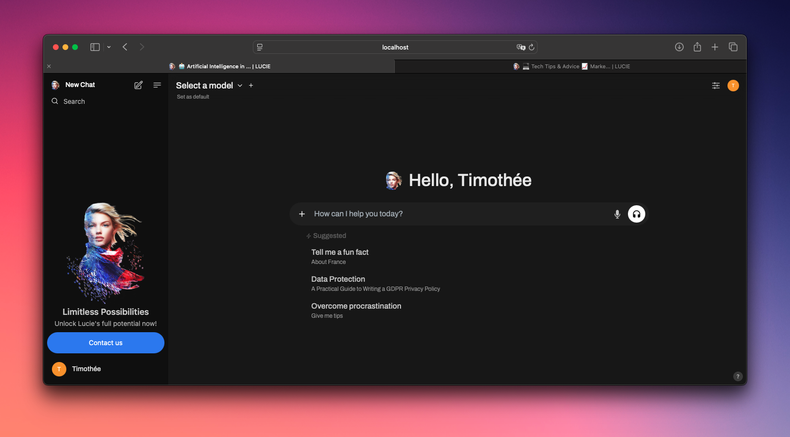

# Open Webui Lucie

This fork of [Open-Webui](https://github.com/open-webui/open-webui) is a web interface for [Lucie](lucie.chat) developped by [OpenLLM-France](https://github.com/OpenLLM-France) and [LINAGORA](https://linagora.com).

Please refer to the original project for manual installation instructions and faq.



# Docker

We provide a Docker image for easy deployment. Please note the model expects 11Gb of VRAM (falling back to system memory on CPU) to run. If additional parallel request handling is needed, expect 5Gb of additional memory necessary per additional request added to the `OLLAMA_NUM_PARALLEL` environment variable.

If using Docker Desktop, it is beneficial to increase the memory limit to at least 12Gb in order to avoid using swap.

Use the following docker-compose for a quick start:

```yaml

services:
  ollama:
    volumes:
      - ollama:/root/.ollama
    container_name: ollama
    pull_policy: always
    tty: true
    restart: unless-stopped
    image: ollama/ollama:latest
    environment:
      - 'OLLAMA_NUM_PARALLEL=1'

  open-webui-lucie:
    image: ghcr.io/openllm-france/open-webui-lucie:latest
    container_name: open-webui-lucie
    volumes:
      - open-webui:/app/backend/data
    depends_on:
      - ollama
    ports:
      - 3000:8080
    environment:
      - 'OLLAMA_BASE_URL=http://ollama:11434'
      - 'WEBUI_SECRET_KEY='
      - 'WEBUI_AUTH=false'
    extra_hosts:
      - host.docker.internal:host-gateway
    restart: unless-stopped

volumes:
  ollama: {}
  open-webui: {}

```